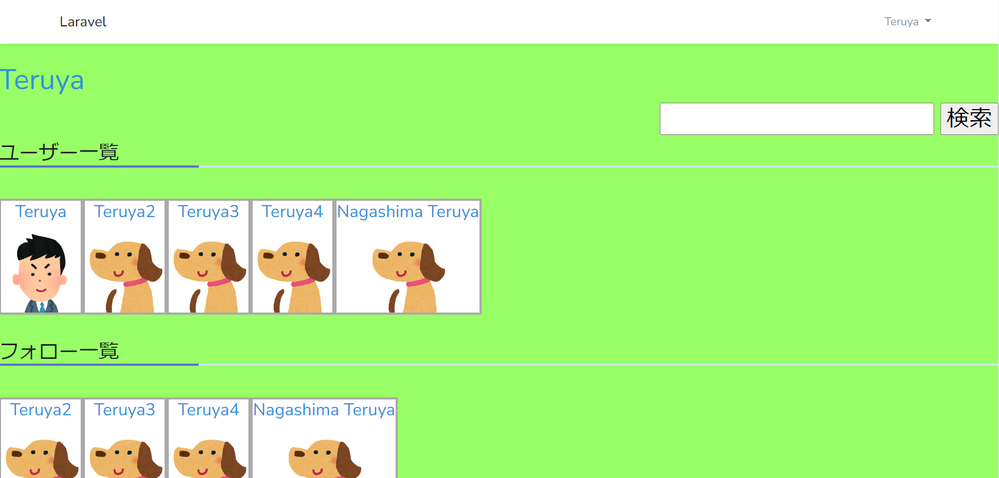
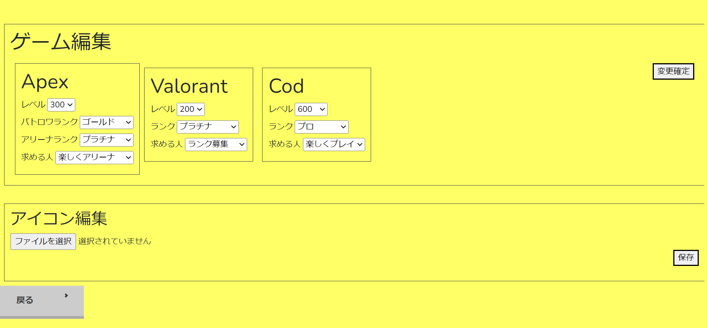
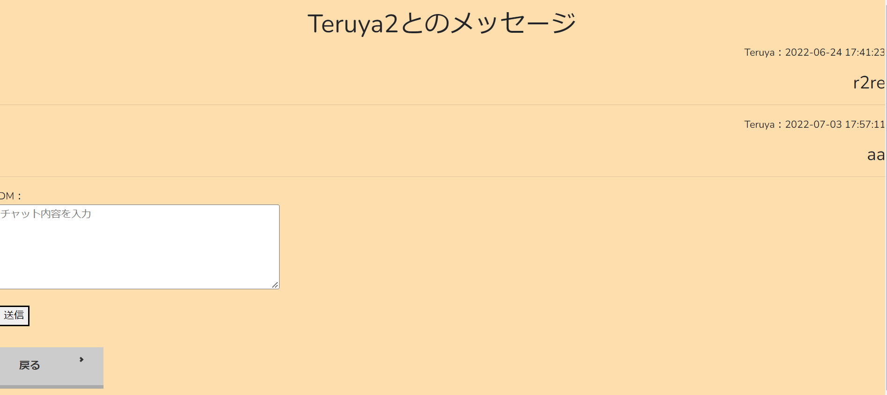

# PGW

## 目的
友人などをゲームに誘っても、予定などがあり一緒に出来ない時、気軽に一緒に出来る人を誘えるアプリがあったら良いなと思ったため

## 開発環境
使用言語
* PHP：Laravel
* HTML
* CSS
* Bootstrap

プラットホーム
* AWS EC2
* MySQL (Maria DB)
* Github

デプロイ
* Heroku

## 機能一覧
ここに機能一覧を書く
* ログイン機能
* グループチャット機能
* チャット部屋作成機能
* DM機能
* グーグルアカウントでのログイン
* マイページ編集機能
* プロフィール表示機能
* アカウント検索機能
* フォロー、フォロワー機能
* おすすめユーザー機能

## 工夫点
### マイページ編集機能

* セレクトボックスで編集画面を見やすくし、簡単に編集できるようにした。
* 以前入力したセレクトボックスの内容を保持することで、全てのセレクトボックスを変更する必要がない

### DM機能

* dmのやり取りしてる相手以外は、メッセージを見れないように作成
* 日付や時間を表示し、更新された順番ごとに表示することで、見やすくした
* 自分が送信したメッセージを右側にし、相手が送信したメッセージを左側に表示することで、メッセージを見やすくした

## 今後の方針
* 反省点
* 序盤の設計図の理解が浅かったため、どのテーブルに何が必要なのかを判断するのに時間がかかってしまった。
* コードが並びが見にくい箇所がいくつかあった。
* 何度も使う基本的なコマンドのスペルを忘れてしまうことがあった。

* 改善案
* 設計図作成の時点で、必要なものと必要でないものを明確に理解する。
* インデントをしっかり揃え、誰が見ても読みやすいようにする。
* 基本的なコマンドは何度も使うので、繰り返し使用し、覚える。

## 成果物作成を通して
私は成果物作成を通して思ったことは、私たちの身近にあるアプリやWebサービスを作成することの難しさを実感することができました。フロントエンド、バックエンドの両方のレベルが高くないと、良いサービスを提供できないので、自分自身がどのようなプログラムにしたいかを考え、それを実行することの大変さを改めて感じました。しかし、難しい課題や自分自身でエラーを解決したとき、思い通りに動いたときなど、プログラミングから得られた面白さ、やりがいなどはたくさんありました。カレッジを卒業した後も自ら進んでプログラミングを学び、目標である「Web企業内定」にむけて学んだ知識を活かし、就活を頑張りたいと思います。
